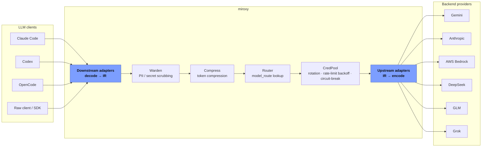
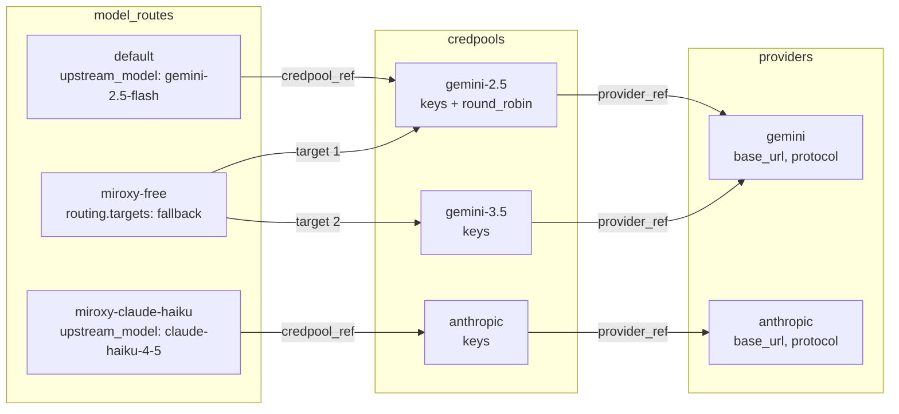

# Miroxy

Miroxy is an Go version LLM API gateway based on [OpenMIR](https://github.com/openmir-io/openmir-spec). It accepts requests from any LLM Client and routes to any upstream providers
Gemini, OpenAI, DeepSeek, Anthropic, GLM, Grok, and AWS Bedrock — behind a
single endpoint. It manages API key pools (rotation, rate-limit backoff,
circuit-breaking), translates wire protocols automatically, and falls back
across providers or keys on failure.

## Current Well tested:
Anthropic
OpenAI
OpenAI-Compatible
---

## Architecture

### Two-level abstraction

The codebase is split into two layers:

- **`core/`** — stable interfaces and pure-Go implementations with no I/O:
  `Selector` (credential/key selection), `Router` (model → upstream target),
  `UpstreamAdapter` (wire protocol for a provider), `DownstreamAdapter` (wire
  protocol for a client), and the IR types. This layer is portable and
  independently testable.
- **`internal/`** — I/O-bound implementations that depend on the network,
  the filesystem, or process state: the HTTP server, concrete upstream/downstream
  adapters, config loading, credential pools, and the plugin pipeline.

Adding a new upstream provider or client-facing protocol means implementing
one adapter against a `core/` interface — no changes to routing, the server,
or other adapters.

### Request pipeline

Every request flows through an ordered chain of plugins (`internal/pipeline`),
each free to inspect or rewrite the request/response before passing it on.
A typical chain, lowest priority first:

```
Auth → Command → Warden (content defense) → Compress (token compression) → Router → Upstream (terminal)
```

`Upstream` is always the terminal plugin — it owns the retry loop across
credentials and targets, and is the only plugin that performs real network I/O
to the provider. Streaming and non-streaming requests are handled by separate
code paths throughout the pipeline; a stream is never buffered through a
non-streaming abstraction.

### Diagram

**Request flow** — any LLM client, transparently adapted through IR, with
compression, PII/secret scrubbing, and credential health all handled before
a request ever reaches a provider:



**Config topology** — how a client-facing `model_routes` entry resolves down
to a real provider call. A route maps to one or more `credpools` (fan-out is
`routing.targets`, for fallback/round-robin/least-requests); multiple
credpools can share one `providers` entry, since a credpool is just an
isolated set of keys and health state for that provider:



---

## Concepts & features

### model_routes, providers, and credpools

Three config sections work together to turn a client-facing model name into
an authenticated call to a real upstream API:

```
model_routes            credpools                  providers
────────────           ───────────                ───────────
model_name        →     credpool_ref        →       provider_ref
upstream_model           (keys, strategy,            (base_url,
                          rate limits,                 protocol,
                          circuit-break)                auth_style)
```

- **`providers`** declares connection defaults for a provider family — its
  `base_url`, wire `protocol`, and `auth_style`. Built-in providers (gemini,
  openai, anthropic, deepseek, glm, grok, bedrock) already have correct
  defaults; declare the name with `{}` unless you're overriding something
  (a relay URL, a self-hosted server, a different auth scheme).
- **`credpools`** holds one or more real API keys for a single provider
  (via `provider_ref`). It owns everything about *that key set's* health:
  rotation strategy, rate limits, circuit-break thresholds, and cooldowns —
  isolated from every other credpool.
- **`model_routes`** is what a client actually requests as `model`. A route
  maps to one `upstream_model` + `credpool_ref` pair directly, or to several
  via a `routing.targets` list with a strategy (`fallback`, `round_robin`,
  `least_requests`) for failover or tiering across providers.

### IR (Intermediate Representation)

Miroxy doesn't convert directly between every pair of client/provider wire
formats. Instead, every `DownstreamAdapter` decodes a client's request into a
common IR, and every `UpstreamAdapter` encodes that IR into its provider's
wire format (and decodes the response back into IR). This means N client
protocols and M upstream providers need N + M converters, not N × M — adding
a provider or a client protocol never touches the other side.

Passthrough is the deliberate exception: when a client's own protocol already
matches a target's protocol, miroxy can forward the original request bytes
and headers verbatim instead of round-tripping through IR, preserving
protocol details (e.g. Anthropic's `anthropic-version` header) that a
canonical IR has no slot for.

---

## Prerequisites

### config.yaml

Copy one of the example files in `config/` to `config/config.yaml` and edit
it. Each example covers a different scenario:

| File | Scenario |
|------|----------|
| `config.yaml.example.min` | Smallest working config — one key, one pool, one route |
| `config.yaml.example.n-keys.1-pool` | Multiple keys in one pool (rotation within one provider) |
| `config.yaml.example.n-keys.n-pools.1-provider` | Multiple isolated pools on one provider (e.g. tiered models) |
| `config.yaml.example.n-keys.n-pools.n-providers` | Multiple providers with fallback routing |
| `config.yaml.example.n-keys.n-pools.n-providers.n-routermodels` | Full multi-route setup, several named models |
| `config.yaml.example.local.protocol` | Self-hosted servers — Ollama, LM Studio, vLLM, LocalAI |
| `config.yaml.example.compatible.protocol` | Third-party OpenAI/Anthropic-compatible providers (DeepSeek, Grok, GLM, OpenRouter, relays) |
| `config.yaml.example.warden` | Content defense — secrets/PII/prompt-injection/jailbreak detection |
| `config.yaml.example.full` | Every field, fully annotated — the reference doc |

For exact field names and defaults, see `config/config.yaml.example.full`.

### secrets.env

`config.yaml` references secrets as `${VAR_NAME}` placeholders; the actual
values come from the process environment. You can provide them either way:

- as a file — copy `config/secrets.env.example` to `config/secrets.env` and
  fill in real values (`make run` and `make docker-run` both load this file), or
- as environment variables passed directly to miroxy at launch, with no file
  involved at all.

To get running immediately: copy `config/config.yaml.example.min` to
`config/config.yaml`, set `GEMINI_KEY` and `MIROXY_CLIENT_KEY`. See the
`config/` directory for every other scenario.

### Ports

| Port | Purpose |
|------|---------|
| **9000** | Proxy — receives LLM traffic from clients |
| **9001** | Admin — management API, localhost only |

Both are configurable (`server.port`, `admin.addr`) — check these aren't
already bound by something else on the host before starting.

---

## Quickstart

### Local run

```bash
make build   # compile ./cmd/miroxy → build/miroxy
make test    # go test ./...
make run     # build + run — auto-loads config/config.yaml and config/secrets.env
```

`make run` fails fast with a clear error if `config/secrets.env` is missing.

### Docker

```bash
make docker-build                  # builds openmir/miroxy:dev
VERSION=1.0.0 make docker-build    # builds openmir/miroxy:1.0.0

make docker-run                    # run container (mounts config.yaml, loads secrets.env)
make docker-logs                   # tail logs
make docker-stop                   # stop and remove
```

---

## Auth Configuration

miroxy checks every client request against `auth.allowed_keys` in
`config.yaml`, accepting either `Authorization: Bearer <key>` or
`x-api-key: <key>` — whichever the client's own protocol sends. Each
section below points a specific client at miroxy with one of those keys,
and, where the client supports it, lets it discover `model_routes` as
native, selectable models instead of a hardcoded model name.

### Claude Code

Claude Code speaks Anthropic's own protocol. Point it at miroxy and give it
a key from `auth.allowed_keys` as either `ANTHROPIC_AUTH_TOKEN` (sent as
`Authorization: Bearer`) or `ANTHROPIC_API_KEY` (sent as `x-api-key`) —
miroxy accepts both.

To make `model_routes` show up in Claude Code's native `/model` picker
instead of typing a model name by hand, also set
`CLAUDE_CODE_ENABLE_GATEWAY_MODEL_DISCOVERY=1`. On startup Claude Code calls
`GET /v1/models`; miroxy detects the `claude-code/*` User-Agent and
auto-prefixes every route's `model_name` with `claude-` (Claude Code only
lists `claude-*` models), so a route named `default` appears as
`claude-default`.

Set these in `~/.claude/settings.json` (or export them in your shell before
launching `claude`):

```json
{
  "env": {
    "ANTHROPIC_BASE_URL": "http://localhost:9000",
    "ANTHROPIC_AUTH_TOKEN": "<a key from auth.allowed_keys>",
    "CLAUDE_CODE_ENABLE_GATEWAY_MODEL_DISCOVERY": "1"
  }
}
```

Then run `/model` inside Claude Code and pick any `claude-<model_name>`
entry.

### Codex

Run `scripts/enable_miroxy_for_codex.sh`. It resolves `model_routes` — from
a `config.yaml` path you pass as `$1`, an auto-discovered
`config/config.yaml`, or miroxy's admin API as a last resort — and writes
both a Codex model catalog and a provider entry:

```bash
export OPENAI_API_KEY=<a key from auth.allowed_keys>   # Codex sends this to miroxy as the bearer token
./scripts/enable_miroxy_for_codex.sh                    # optionally: ./scripts/enable_miroxy_for_codex.sh path/to/config.yaml
```

Resulting `~/.codex/config.toml`:

```toml
model_catalog_json = "/home/you/.codex/miroxy-models.json"
model = "default"
model_provider = "miroxy"

[model_providers.miroxy]
name = "miroxy"
base_url = "http://localhost:9000/v1"
env_key = "OPENAI_API_KEY"
wire_api = "responses"
```

`~/.codex/miroxy-models.json` merges Codex's own model catalog with one
entry per `model_routes` route, so they appear in Codex's model picker.
Run `./scripts/restore_codex.sh` to undo — it restores whatever
`config.toml` / `miroxy-models.json` existed before the enable script ran
(or removes them if nothing did).

### Open Code

Run `scripts/enable_miroxy_for_opencode.sh` — same model-source resolution
as the Codex script, writing into OpenCode's own config instead:

```bash
export MIROXY_AUTH_TOKEN=<a key from auth.allowed_keys>   # OpenCode sends this to miroxy as the bearer token
./scripts/enable_miroxy_for_opencode.sh                    # optionally: ./scripts/enable_miroxy_for_opencode.sh path/to/config.yaml
```

Resulting `~/.config/opencode/opencode.json`:

```json
{
  "provider": {
    "miroxy": {
      "npm": "@ai-sdk/openai-compatible",
      "name": "Miroxy",
      "options": {
        "baseURL": "http://localhost:9000/v1",
        "apiKey": "{env:MIROXY_AUTH_TOKEN}"
      },
      "models": {
        "default": { "name": "default", "description": "Routed via miroxy" }
      }
    }
  },
  "model": "miroxy/default"
}
```

`MIROXY_AUTH_TOKEN` is read from the environment at OpenCode startup, not
written into the file — export it in `~/.bashrc`/`~/.zshrc` or your shell
before launching OpenCode. Select any `miroxy/<model_name>` entry as your
model. Run `./scripts/restore_opencode.sh` to undo.

### Other code agents

Not yet tested against miroxy, but any agent that accepts a custom OpenAI-
or Anthropic-compatible endpoint should work the same way as Claude Code,
Codex, or OpenCode above:

- Point its base URL at `http://localhost:9000/v1` (OpenAI-compatible) or
  `http://localhost:9000` (Anthropic-compatible).
- Set its API key/token field to a value from `auth.allowed_keys`.
- If it has a "list models from server" or gateway-discovery setting,
  enable it to pull `model_routes` directly instead of hardcoding a model
  name.

### Raw client

Any HTTP client can call miroxy directly, with no client-specific setup —
use whichever wire protocol matches the route's client protocol, and either
auth header:

```bash
# Anthropic protocol
curl http://localhost:9000/v1/messages \
  -H "x-api-key: <a key from auth.allowed_keys>" \
  -H "anthropic-version: 2023-06-01" \
  -H "Content-Type: application/json" \
  -d '{"model": "default", "max_tokens": 1024, "messages": [{"role": "user", "content": "hi"}]}'

# OpenAI protocol
curl http://localhost:9000/v1/chat/completions \
  -H "Authorization: Bearer <a key from auth.allowed_keys>" \
  -H "Content-Type: application/json" \
  -d '{"model": "default", "messages": [{"role": "user", "content": "hi"}]}'
```

`model` is whatever the route is named in `model_routes` — it needs no
client-specific prefix.
